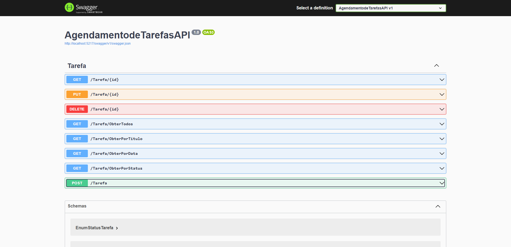

# CRUD Agendamento de Tarefas
Esse foi um desafo da trilha Bootcamp **XP Inc. - Full Stack Developer** da DIO que propõe criar um projeto de gerenciamento de tarefas, onde é possível cadastrar tarefas que organizará melhor a rotina.
